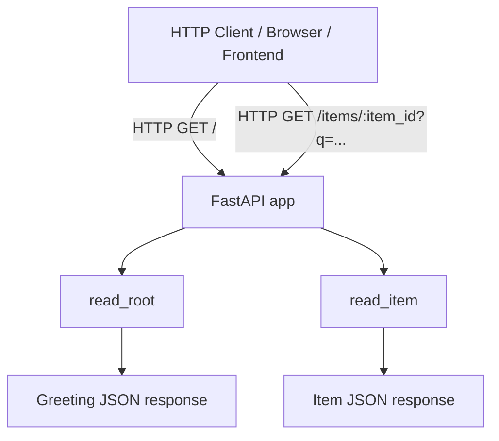
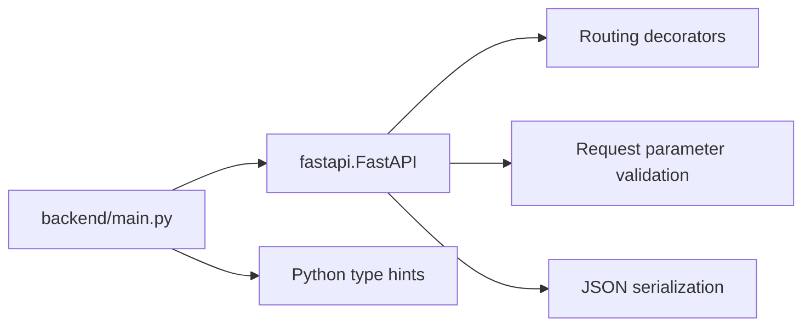
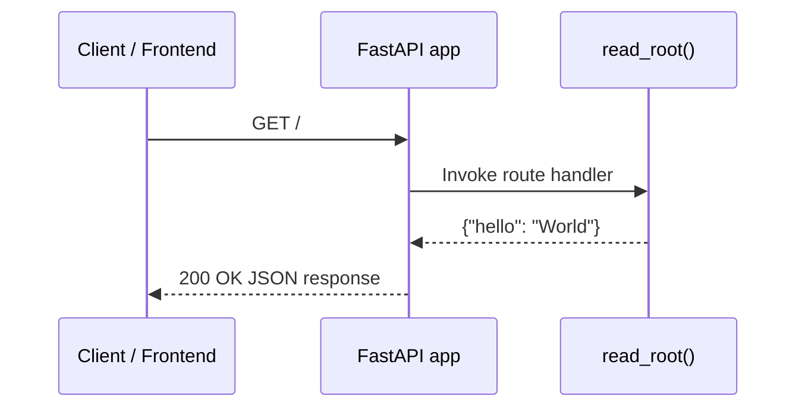
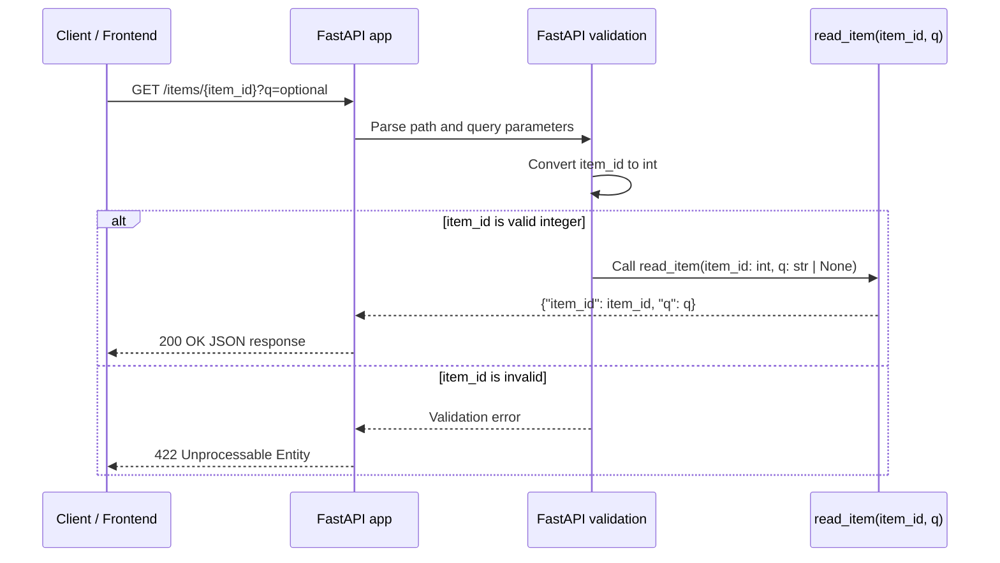
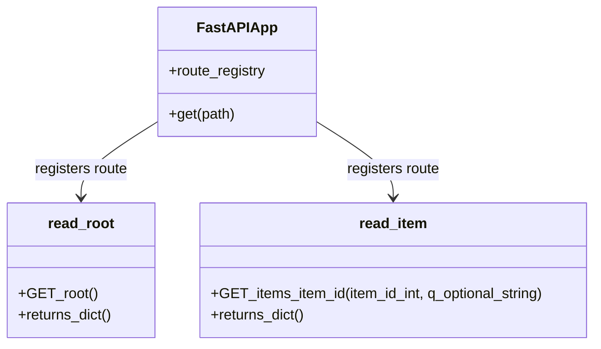
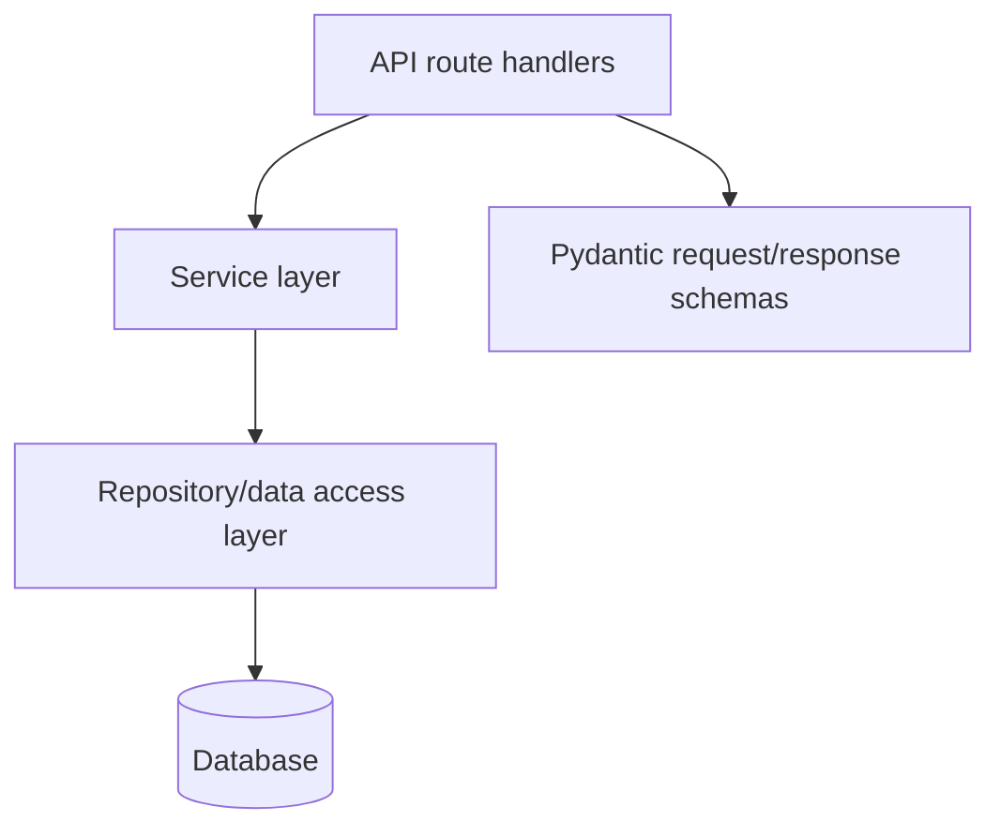

# Backend Module Documentation

## Introduction

The `backend` module provides the server-side HTTP API for the application. It is implemented with [FastAPI](https://fastapi.tiangolo.com/) and currently exposes two simple GET endpoints:

- `GET /` — health-style/root endpoint returning a greeting payload.
- `GET /items/{item_id}` — item lookup-style endpoint demonstrating path and optional query parameter handling.

This module is the API surface that client applications, including the [frontend](frontend.md), can call over HTTP.

---

## Module Overview

### Location

```text
backend/
└── main.py
```

### Core Components

| Component | Type | Responsibility |
|---|---|---|
| `app = FastAPI()` | FastAPI application instance | Registers routes and acts as the ASGI application entry point. |
| `read_root()` | Route handler | Handles `GET /` and returns a static JSON response. |
| `read_item(item_id: int, q: str | None = None)` | Route handler | Handles `GET /items/{item_id}`, validates `item_id` as an integer, accepts optional query parameter `q`, and returns both values as JSON. |

---

## Architecture

The backend is intentionally minimal. `backend/main.py` defines the FastAPI application instance and attaches route handler functions using FastAPI decorators.



### Key Architectural Characteristics

- **Framework:** FastAPI provides routing, request parsing, type validation, and JSON serialization.
- **Entry point:** The `app` object in `backend/main.py` is the ASGI application typically served by an ASGI server such as Uvicorn.
- **Stateless handlers:** Current handlers do not access a database, filesystem, cache, or external service.
- **Automatic validation:** FastAPI uses Python type hints to validate path and query parameters.

---

## Component Details

## `app = FastAPI()`

The `app` instance is the central application object. Route decorators such as `@app.get(...)` register Python functions as HTTP request handlers.

```python
from fastapi import FastAPI

app = FastAPI()
```

In a development environment, this app is commonly run with a command similar to:

```bash
uvicorn backend.main:app --reload
```

> The exact run command may vary depending on the project packaging and deployment setup.

---

## `read_root()`

```python
@app.get("/")
def read_root():
    return {"hello": "World"}
```

### Responsibility

Handles requests to the root path `/`.

### Endpoint Contract

| Property | Value |
|---|---|
| HTTP method | `GET` |
| Path | `/` |
| Request body | None |
| Path parameters | None |
| Query parameters | None |
| Response format | JSON object |

### Response

```json
{
  "hello": "World"
}
```

### Typical Uses

- Basic connectivity check.
- Smoke test for verifying that the FastAPI application is running.
- Minimal example endpoint for local development.

---

## `read_item(item_id: int, q: str | None = None)`

```python
@app.get("/items/{item_id}")
def read_item(item_id: int, q: str | None = None):
    return {"item_id": item_id, "q": q}
```

### Responsibility

Handles requests for a specific item identifier and optionally echoes a query parameter.

### Endpoint Contract

| Property | Value |
|---|---|
| HTTP method | `GET` |
| Path | `/items/{item_id}` |
| Request body | None |
| Path parameters | `item_id` |
| Query parameters | `q` optional |
| Response format | JSON object |

### Parameters

| Parameter | Source | Type | Required | Description |
|---|---|---:|---:|---|
| `item_id` | Path | `int` | Yes | Numeric item identifier extracted from the URL path. |
| `q` | Query string | `str \| None` | No | Optional query value. Defaults to `None` when omitted. |

### Example Requests

```http
GET /items/123
```

Response:

```json
{
  "item_id": 123,
  "q": null
}
```

```http
GET /items/123?q=search-term
```

Response:

```json
{
  "item_id": 123,
  "q": "search-term"
}
```

### Validation Behavior

FastAPI validates `item_id` according to the function annotation `item_id: int`.

For example, this request is invalid because `abc` cannot be parsed as an integer:

```http
GET /items/abc
```

FastAPI will return a validation error response, typically with HTTP status `422 Unprocessable Entity`.

---

## Dependency Relationships

The backend module currently has a single direct framework dependency: FastAPI.



### Internal Dependencies

There are no internal backend submodules or service-layer dependencies at this time.

### External/System Dependencies

| Dependency | Purpose |
|---|---|
| `fastapi.FastAPI` | Defines the ASGI app, route decorators, request validation, and response serialization. |
| ASGI server, for example Uvicorn | Required at runtime to serve the FastAPI app over HTTP. Not shown in code but commonly used. |

---

## Request/Data Flow

### Root Endpoint Flow



### Item Endpoint Flow



---

## Component Interaction Model



Although the handlers are plain Python functions, FastAPI binds them into its internal routing system through decorators.

---

## How the Backend Fits Into the Overall System

The current module tree contains both a backend and a frontend:

```text
backend
└── backend/main.py

frontend
└── frontend/vite.config.ts
```

At a system level, the backend provides HTTP API endpoints, while the frontend is expected to provide the browser-facing user interface and development/build configuration. See [frontend documentation](frontend.md) for frontend-specific details.


Because the current backend handlers are simple echo/static endpoints, there is not yet a domain model, persistence layer, authentication layer, or background processing system.

---

## API Summary

| Method | Path | Handler | Description |
|---|---|---|---|
| `GET` | `/` | `read_root` | Returns a static greeting payload. |
| `GET` | `/items/{item_id}` | `read_item` | Returns the integer path parameter and optional query parameter. |

---

## Operational Notes

### Running Locally

A typical local command is:

```bash
uvicorn backend.main:app --reload
```

Then call the endpoints:

```bash
curl http://localhost:8000/
curl "http://localhost:8000/items/42?q=test"
```

### OpenAPI Documentation

FastAPI automatically exposes interactive API documentation by default:

- Swagger UI: `/docs`
- ReDoc: `/redoc`
- OpenAPI schema: `/openapi.json`

These routes are provided by FastAPI as long as they have not been disabled in the `FastAPI()` configuration.

---

## Maintainability Guidance

As the backend grows, consider introducing additional layers and conventions:



Recommended future improvements:

1. **Separate route modules** when endpoints grow beyond a few handlers.
2. **Use Pydantic models** for explicit request and response schemas.
3. **Add tests** for route behavior and validation responses.
4. **Introduce configuration management** for environment-specific settings.
5. **Add CORS configuration** if the frontend is served from a different origin during development or production.
6. **Add structured error handling** for consistent API responses.

---

## Current Limitations

- No persistence layer or external integrations.
- No authentication or authorization.
- No explicit response models.
- No custom error handling.
- No route grouping/versioning, such as `/api/v1`.
- No CORS configuration visible in the current code.

---

## Source Reference

Primary source file:

```text
backend/main.py
```

Core implementation:

```python
from fastapi import FastAPI

app = FastAPI()


@app.get("/")
def read_root():
    return {"hello": "World"}


@app.get("/items/{item_id}")
def read_item(item_id: int, q: str | None = None):
    return {"item_id": item_id, "q": q}
```
