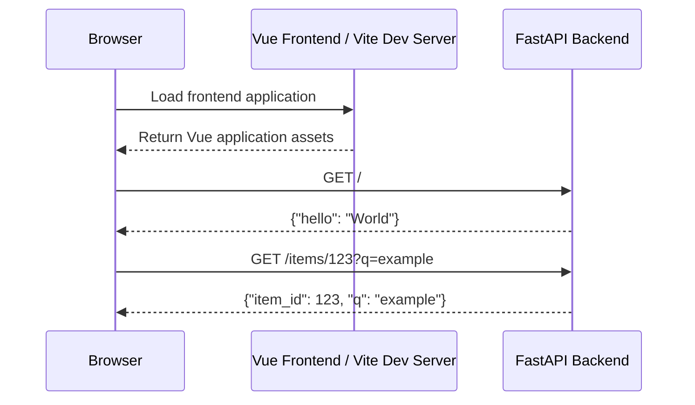

# max-agent Module Documentation

## Purpose

`max-agent` is a minimal full-stack application scaffold composed of:

- a **FastAPI backend** exposing HTTP API endpoints, and
- a **Vue/Vite frontend** configured for client-side development.

The current implementation provides a small backend API with two routes and a frontend build configuration that enables Vue support through Vite.

## Architecture Overview

```mermaid
flowchart LR
    User[User / Browser] --> Frontend[Vue application served by Vite]
    Frontend -->|HTTP requests| Backend[FastAPI application]
    Backend --> Root[GET /]
    Backend --> Item[GET /items/{item_id}]
```

At this stage, the frontend configuration and backend API are independent code areas. The backend exposes JSON responses, while the frontend is prepared to host Vue components that can consume those APIs.

## Main Components

### Backend API

The backend is implemented in `backend/main.py` using FastAPI. It defines the application object and two route handlers:

- `read_root()` for `GET /`
- `read_item(item_id: int, q: str | None = None)` for `GET /items/{item_id}`

Detailed backend documentation will be generated in [backend.md](backend.md).

### Frontend Build Configuration

The frontend is configured in `frontend/vite.config.ts`. It exports a Vite configuration created with `defineConfig()` and registers the Vue plugin.

Detailed frontend documentation will be generated in [frontend.md](frontend.md).

## Request Flow



## Current Scope and Extension Points

The module is intentionally small and suitable as a starting point for further development:

- Backend routes can be expanded with additional FastAPI routers, models, services, and persistence integrations.
- Frontend Vue components can be added under the frontend project and wired to backend APIs.
- Shared API contracts can be documented or generated from FastAPI OpenAPI metadata as the system grows.
